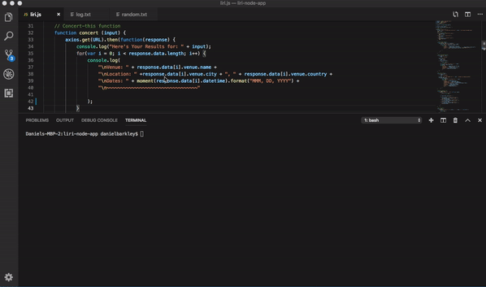
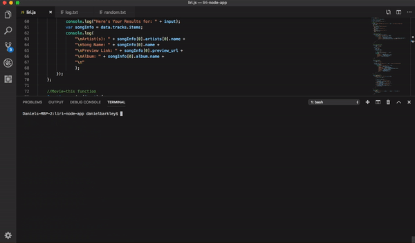
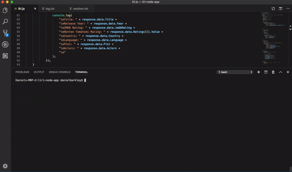
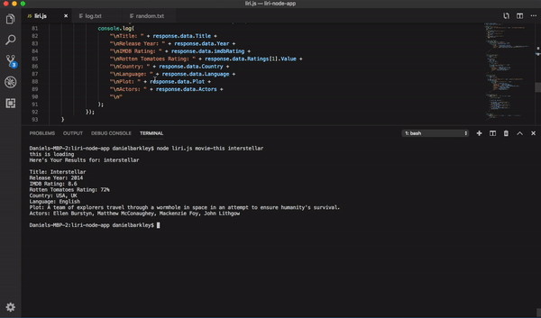

# Liri Node app

LIRI is a _Language_ Interpretation and Recognition Interface. LIRI will be a command line node app that takes in parameters and gives you back data.

## Instructions

### 1. Type the following command into your terminal/bash: `node Liri.js concert-this <band name here>`

- Using Bands in Town Artist Events API this will display the following information about each event to the terminal/bash window:

  * Name of the venue

  * Venue location

  * Date of the Event

### 2. Type the following command into your terminal/bash: `node Liri.js spotify-this-song '<song name here>'`

- Using node-spotify-API this will display the following information about the song in terminal/bash window

  * Artist(s)

  * The song's name

  * A preview link of the song from Spotify

  * The album that the song is from

### 3. Type the following command into your terminal/bash: `node Liri.js movie-this '<movie name here>'`

- Using OMDB API This will display the following information to your terminal/bash window:

    * Title of the movie.

    * Year the movie came out.

    * IMDB Rating of the movie.

    * Rotten Tomatoes Rating of the movie.

    * Country where the movie was produced.

    * Language of the movie.

    * Plot of the movie.

    * Actors in the movie.

### 4. Type the following command into your terminal/bash: `node Liri.js do-what-it-says`

- This will take the command in the random.txt and then use it to call one of above commands.

## Examples:

### 1. Concert-this

### 2. Spotify-this-song-this

### 3. movie-this

### 4. do-what-it-says-this

